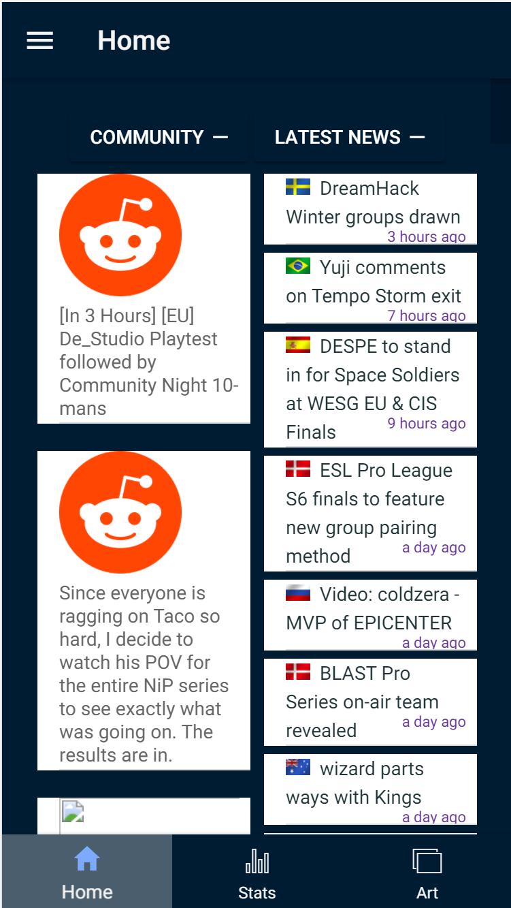
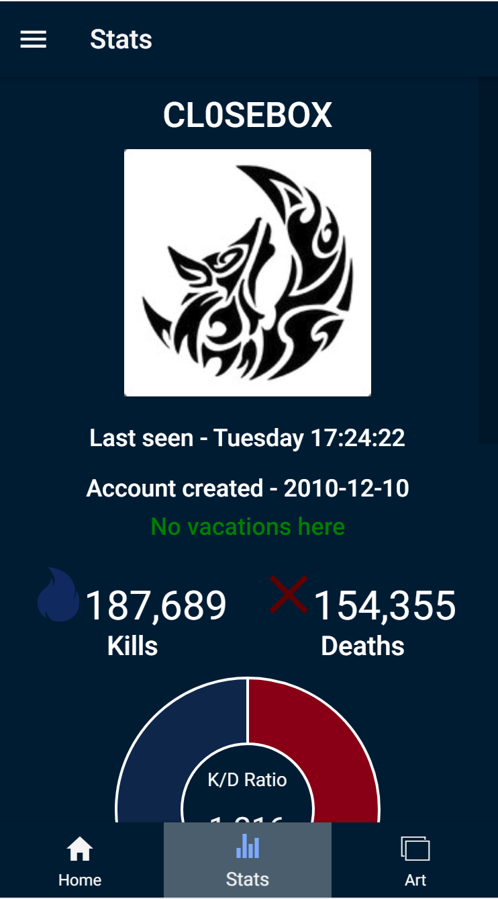
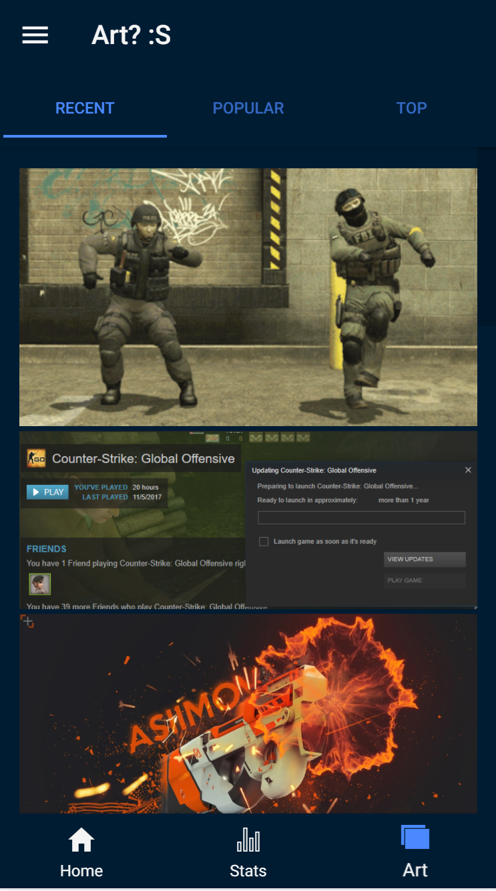

# Stats
An App using the cs api displaying information about the specific user (atm this api displays my information)

I also scrape news sources regarding the game topic

Aswell scraping "Art" from steams csgo community.

The regular login which was made in mongodb can only be used localy so firebase is used instead.

NOTE! This ionic state is two parts one ionic project and one nodeJS project handeling the localdb and steam apis.

FIREBASE LOGIN: user:vidar@vidar.se  pw:123456

  

  

  

